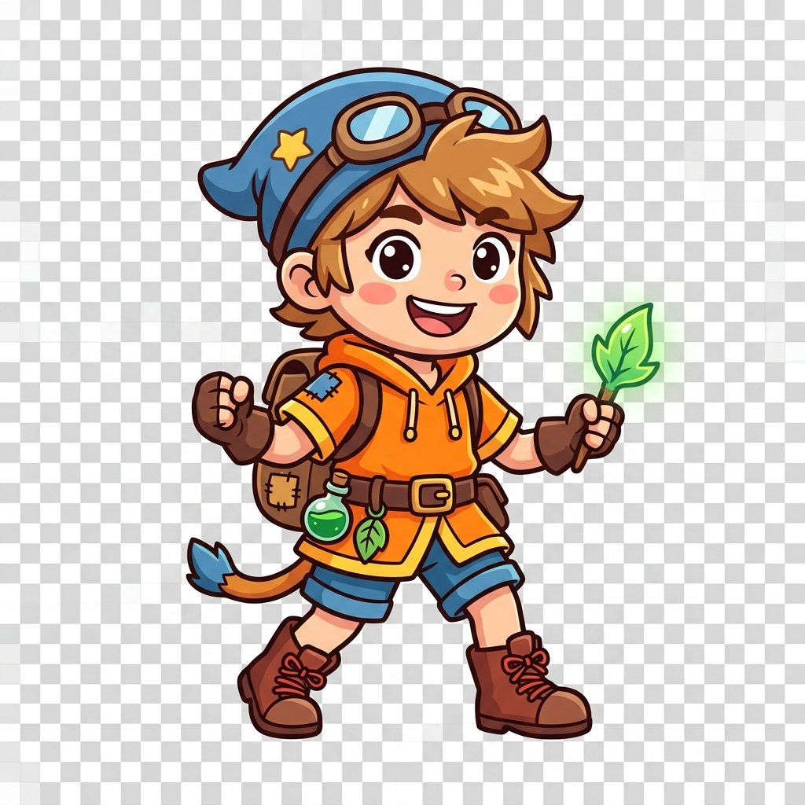

# 1151VR-HW2-414262272-LCH

## 一、專案截圖

### 截圖 1：2D 人物圖片匯入與 Sprite 設定
請AI生成的照片
 

### 截圖 2：場景配置與路徑節點

---

## 二、GitHub 連結
- [https://github.com/Johnson-bro-coder/1151VR-HW2-414262272-LCH](https://github.com/Johnson-bro-coder/1151VR-HW2-414262272-LCH)

---

## 三、YouTube 連結
- [https://youtu.be/udeUsE2yahY](https://youtu.be/udeUsE2yahY)

---

## 四、說明製作流程和相關操作

### 1. 2D 專案與角色圖片載入
- 使用 Unity 2D 專案架構。
- 將 2D 角色圖片放入 `Assets/Sprites/Player.png`，並在 Inspector 視窗中將 **Texture Type** 設定為 `Sprite (2D and UI)`，確保可以在 2D 遊戲場景中正確渲染。

### 2. 實作平走、上跳與下跳終點（使用 Vector 與 Array 陣列）
在 `Assets/Scripts/PlayerMovement.cs` 中實作核心邏輯：
- **宣告 Vector3 陣列**：使用 `public Vector3[] pathPoints` 儲存多個位移座標：
  - 索引 0：起點 `(-5, -1.8, 0)`
  - 索引 1：往前走 `(-1.5, -1.8, 0)`
  - 索引 2：向上跳躍 `(1.5, 1.8, 0)`
  - 索引 3：向下跳落到達終點 `(5, -1.8, 0)`
- **位移演算法**：使用 `Vector3.MoveTowards()` 配合 `Time.deltaTime` 。
- **節點判定**：透過 `Vector3.Distance(transform.position, targetPos) < 0.05f` 判斷是否抵達目標點，抵達後自動將陣列索引遞增 `currentIndex++` 移向下一站。
- **重播功能**：加入按鍵偵測，按下鍵盤 <kbd>R</kbd> 或 <kbd>Space</kbd> 即可隨時重置回起點重新演示，方便錄影。
